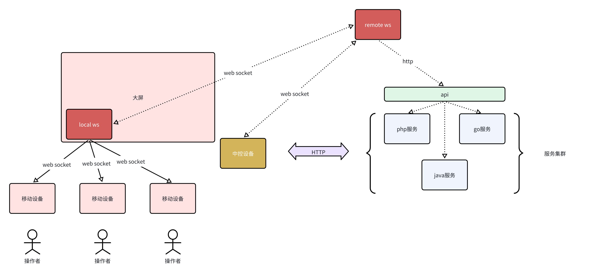

# WebRTC

## Mention
本项目内容-WebRTC是组内项目的重点，目前我将抽出技术重点和技术难点与大家分享。   
需要考虑WebSocket长链接的稳定性，可能会出Go的版本来进行维护。涉及到的核心中间件件有**Redis** 和 **Nacos**。   
尽请期待～ 

## WebRTC基础知识整理 🚀
可以点击链接右边👉优先查看哦～（目前MarkDown的格式还在梳理）：[WebRTC知识梳理](./WebRTC知识梳理.md)

## 开发时间线 📝
1. 2024.11.18 完成第一版java信令服务器开发，并实现前后端联调  
    1. 只支持本地多端投屏（浏览器点开两个tab或者跨浏览器都可以，但是内网和公网状态下多主机投屏互动还没有完成）
 2. 2024.11.26 组内确定了基本的解决方案，并尝试开始搭建了。

--- 

## 分布式架构下的WebSocket连接 🔗

1. WebSocket连接： 客户端通过WebSocket连接服务器，服务器根据不同ws路由创建不同的session，哪怕是同一个ip。
2. 分布式架构下，多个ws服务器以多个pod的形式存在。此时ip的连接可能会被service负载均衡到不同的pod中。  
	在linux中，一切皆文件。WebSocket的连接都会以文件的形式存在，此时就需要要拿到fd标识就可以找到WebSocket连接的地址。
	   所以回到我们的场景需求中。我们需要进行点对点的投屏。所以客户端连接WebSocket 就需要知道另外一个客户端连接的WebSocket 的 WebSocketSession对象。
	   此时由于我们是多个pod，那么我们就无法在当前服务的room中找到我们需要的WebSocketSession对象。所以此时就需要中间层redis来记录和标识这些fd标识。    

3. 解决思路：   
	   a. socket连接产生的WebSocketSession对象会存在内存中，此时会有fd标识这一个对象。我们将sessionId和fd绑定为key-value。   
	   b. 然后在redis中设置一个room的房间概念。   
	   c. 根据房间id和学生id（或者是客户端ip，一切可以标识客户端设备的id都行）在一个pod中找到对应客户端唯一标识。    
		d. 如果没有挂载，那么可以在每一个pod中写一个http接口，通过接口实现多个pod的通信，进而将信令消息转发给其他pod，然后对应的pod又可以直接获取WebSocketSession对象进行转发，从而实现分布式架构下的signal信令转发。  
	
3. 核心关键点：
* pod 服务本身应该是无状态容器，但是WebSocket连接对象是有状态的。所以需要将这些有状态对象进行抽离，从而使得整个pod变成无状态容器。   
 * 将数据中心化，使用redis。或者是将多个容器的fd的存储挂载到同一个容器中。甚至还可以使用进程通信的一系列技术：共享内存等，实现fd的共享。
 * 每次连接 设置ack 返回连接确认状态    
 * service 路由的时候 使用loadbalance。此时WebSocket连接如何合理的分配到不同的pod上是需要优化的。service本身的allocate算法需要进行优化，让每个pod的连接数变得平均 

--- 

## 系统架构图
话不多说，我直接来展示项目架构图来与你一起分享。 「考虑到组内的知识产权，我将设计方案进行了抽象」  

### 架构介绍：
#### 1. 业务场景：  
现在是在一件会议室里面，有一个会议大屏，同时所有参会者持有一个设备用作会议记录，同时会议室有一个中控平台操作会议大屏的具体操作。此时会议的主讲人就可以操作中控平台并进行相应的汇报工作，而参会者便可以登录工作软件，参加会议，并做相应的互动操作。

> 现在确认了我的业务场景之后，我们就来进行下一步的说明

#### 2. 业务场景描述：   
在这个业务场景中，我每个参会者都可以和会议室的大屏发起互动操作。例如白板写字，聊天等一系列**实时性要求高**的活动。对于这种实时性要求高的场景，我们采取的解决webSocket，这个就和WebRTC联系在一起了。在WebRTC中，我们需要搭建一个信令服务器，来转发offer、answer、candidate的信息。那么这样的话，对于互动和WebSocket和信令服务器的WebSocket就可以放在一个服务里了。这就就节省了资源，也节省开发成本。    

#### 3. 实例描述
1. local-ws：一个部署于会议室大屏的本地WebSocket服务，是局域网内的信令服务器，负责转发局域网内连接的设备发送的offer、answer、candidate。
2. remote-ws：一个部署在云端的远端WebSocket服务，不负责WebRTC的交互部分，目的是与「中控设备」产生交互。
> 看到这里，你会产生一个疑问，为什么要搭建一个本地的WebSocket服务呢？原因看下面👇

3. 搭建local-ws的原因：现在的情况是，每一个会议室，都会有一个本地的WebSocket服务，用于局域网内的WebRTC信令交互和互动指令的下发。其原因是减少远端服务的压力。假设我们只有远端的remote-ws，那么100个会议室，每一个会议室有15个人，那么在一个时间内内就会有1500个WebSocket连接。这对于部署在云端的服务器来说，压力是很大的。所以我们就要考虑将压力转移到「会议室」这个实体里面。通过消息转发，我们将每一个设备的通过WebSocket传递的消息转发到远端的remote-ws中，这样我们remote-ws的连接就从1500降至100个连接，这对于服务器压力的缓解还是相当可观的。  

4. 中控设备：管理大屏交互，管理大屏的一系列操作。
5. 服务集群：服务集群依然稳定，通过对外暴露接口的形式对外提供服务。

整体来说，这一次项目的项目架构就是如此。关键是链路很长，交互的逻辑很复杂，我们既需要兼顾历史逻辑，又需要拓展的新的功能。所以总的来说，任务艰巨啊。

